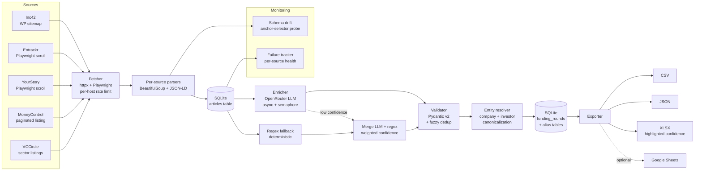

# Indian Startup Funding Intelligence Pipeline

Production-grade data pipeline that scrapes Indian startup funding news from five sources, enriches raw article text into structured records via an LLM (with a 24-sector canonical taxonomy + deterministic regex fallback), canonicalizes company and investor names across sources, and exports to CSV / JSON / Excel plus a **single-file interactive dashboard** with three tabs (rounds · investors · companies). Runs unattended on a daily GitHub Actions cron.

**103 tests passing.** ~3x throughput vs sequential baseline. [Sample CSV](exports/sample_rounds.csv) · [Live dashboard](https://ryrk1020.github.io/indian-funding-pipeline/) (auto-refreshed daily).

---

## Dashboard

The daily workflow generates a self-contained `docs/index.html` — zero server, opens on double-click — with three tabs:

- **Rounds** (default): KPIs, filters (date / stages / sectors / amount / confidence / free-text search), 6 interactive charts including a **sector-mix-over-time stacked bar**, sortable table with row drawer.
- **Investors**: live-filtered top investors table (deals · lead counts · $ touched) + co-investment pairs. Click any row to jump to that investor's rounds.
- **Companies**: per-company round timeline with stage badges, amounts, and lead investors — stage progression at a glance.

Filters flow across all three tabs. Charts and aggregates recompute client-side on every filter change.

Stack: Jinja2 (templating) + ECharts 5 (charts) + Alpine.js 3 (reactivity) + Tailwind CSS 3 (styling). No build step.

Generate locally: `python -m pipeline.run export --format html --out docs`

---

## Architecture



---

## The LLM-vs-regex story

On a live 10-article corpus, the LLM (`openai/gpt-oss-120b:free` via OpenRouter) correctly distinguished real funding rounds from adjacent news (quarterly earnings, ESOP grants, IPO prep) using its confidence score. The regex-only fallback previously mis-labeled investors as companies and treated non-funding pieces as rounds.

| Company | Stage | Confidence | Method | Actually a round? |
|---|---|---:|---|---|
| The Hosteller | Series B | 0.95 | `llm` | Yes |
| Hocco | Series C | 0.95 | `llm` | Yes |
| Sarla Aviation | Series A | 0.85 | `llm` | Yes |
| Bluestone | undisclosed | 0.30 | `llm+regex` | No (ESOP grant) |
| Amagi | undisclosed | 0.30 | `llm+regex` | No (IPO prep) |
| Pocket FM | undisclosed | 0.30 | `llm+regex` | No (profitability announcement) |
| ZoloStays | undisclosed | 0.24 | `llm+regex` | No (revenue report) |

The merge is `0.6 × LLM + 0.3 × regex` capped at 0.75, so regex can't mask a confident LLM "no." Downstream, `--min-confidence 0.85` ships only the trustworthy rows.

---

## What's in the box

**Scraping**
- Five scrapers, each demonstrating a different listing pattern:
  - **Inc42** — WordPress sitemap (`post-sitemap54.xml`) with slug keyword filter. Archive discovery at scale.
  - **Entrackr** — Playwright infinite-scroll on the homepage, static `httpx` for detail. Dynamic JS + mixed strategy.
  - **YourStory** — Playwright for *both* list and detail (site 403s non-browser TLS fingerprints). Hardened anti-bot.
  - **MoneyControl** — static paginated `/news/business/startup/page-N/`. Mainstream media firehose.
  - **VCCircle** — static sector-scoped listings (TMT + Consumer). PE/VC specialist, high signal-to-noise.
- Per-host token-bucket rate limiter + tenacity exponential-backoff retries.
- Browser User-Agent + custom `X-Crawler-Identity` header (polite, identifiable).

**Enrichment**
- OpenRouter-backed LLM via the OpenAI SDK (`AsyncOpenAI` with `base_url="https://openrouter.ai/api/v1"`).
- **Multi-model fallback chain** — on 429 / 404 the enricher advances permanently to the next free model and keeps processing. Configured via `OPENROUTER_FALLBACK_MODELS` (CSV).
- JSON-mode prompt with strict schema (including a **24-sector canonical taxonomy** injected into the system prompt), defensive parsing (`_coerce_json` strips code fences, grabs outermost `{...}` if model wraps in prose).
- **Sector normalization**: `pipeline/sectors.py` maps any LLM sector string (alias table + rapidfuzz fallback) to one of `fintech`, `saas`, `healthtech`, …, `other`. No more free-text sector drift.
- Deterministic regex fallback covering `$8 Mn`, `Rs 150 Cr`, `₹22 Cr`, `Series A/B/C…`, `led by`, `participation from`.
- **Parallel enrichment** under `asyncio.Semaphore(PIPELINE_MAX_CONCURRENCY)` — 10 articles in ~31s (vs ~99s sequential).
- Tenacity retries on `APITimeoutError`, `APIConnectionError`, `InternalServerError` with `wait_random_exponential(max=20s)`. Rate-limit and 404 errors skip to the next model instead of retrying.

**Validation + dedup + entity resolution**
- Pydantic v2 everywhere: future-date rejection, >$50B amount rejection, company-name cleanup, case-insensitive investor dedup with lead-flag upgrade.
- Deterministic `round_id = sha256(company|date|amount_usd)[:16]` collapses exact cross-source mentions.
- Fuzzy cross-source dedup via `rapidfuzz.token_set_ratio ≥ 88` on normalized names (strips `Pvt Ltd`, `Technologies`, punctuation) + ±3-day date window + ±15% amount window. `Bluestone` ≡ `Bluestone Jewellery Pvt Ltd`.
- **Company canonicalization**: every insert calls `resolve_company()` — alias table lookup → fuzzy match against existing canonicals → register as new. Two sources reporting the same firm with different spellings end up on one canonical row.
- **Investor canonicalization**: tight exact-match-after-normalization (strips `LLP`, `Pvt Ltd`) + seed alias table for known aggregators (`Sequoia Capital India` → `Peak XV Partners`, `Matrix Partners India` → `Z47`, etc.). Fuzzy matching is intentionally disabled for investors — subset matches too easily collapse distinct firms.
- Backfill scripts in `scripts/` (`backfill_sectors.py`, `backfill_entities.py`) re-canonicalize existing rows whenever the taxonomy or alias seed changes.

**Storage**
- SQLite with WAL, FK ON, `INSERT ... ON CONFLICT DO UPDATE` upserts. `articles.url` UNIQUE is the natural idempotency key.
- Tables: `articles`, `funding_rounds`, `round_sources`, `round_investors`, `run_log`, `schema_baselines`, `company_aliases`, `investor_aliases`.

**Monitoring**
- **Schema drift** (`monitoring/schema_drift.py`): per-source anchor selectors (`h1.entry-title`, `div.entry-content`, `meta[property="article:published_time"]` for Inc42 etc.) probed on each run's first article. Regression from baseline ≥1 → 0 flags drift in `run_log.schema_drift_flag`.
- **Failure tracker** (`monitoring/failure_tracker.py`): per-source health (OK / WARN / STALE / DRIFT / CRITICAL) based on 7-day run history. Surfaces silent breakage — consecutive zero-article runs are flagged even when no exception was raised.

**Exports**
- CSV (pipe-joined multi-values), JSON (arrays for investors/sources), **XLSX** with frozen header + green/red confidence highlighting, optional Google Sheets (idempotent worksheet replace).
- `--min-confidence` filter lets you ship only trustworthy rows.

**Automation**
- `.github/workflows/ci.yml` — ruff + pytest on every push/PR.
- `.github/workflows/daily.yml` — 02:00 UTC daily cron + `workflow_dispatch`: full scrape → enrich → export → upload artifact → auto-commit refreshed `exports/sample_rounds.*` back to the repo.

---

## Stack

Python 3.13 · HTTPX · Playwright · BeautifulSoup (lxml) · Pydantic v2 · pydantic-settings · SQLite (WAL) · OpenRouter (OpenAI SDK) · rapidfuzz · tenacity · Loguru · Typer · Rich · openpyxl · gspread · GitHub Actions

---

## Quick start

```bash
git clone https://github.com/ryrk1020/funding-pipeline
cd funding-pipeline

python -m venv .venv
.venv\Scripts\activate                    # Windows
# source .venv/bin/activate                # macOS/Linux

pip install -e ".[dev]"
python -m playwright install chromium

cp .env.example .env
# edit .env, set OPENROUTER_API_KEY=sk-or-v1-...
# get a free key at https://openrouter.ai/keys
```

### CLI

```bash
python -m pipeline.run scrape                       # scrape all enabled sources
python -m pipeline.run scrape --source inc42         # one source
python -m pipeline.run scrape --limit 5              # cap articles/source

python -m pipeline.run enrich --limit 10             # LLM enrichment
python -m pipeline.run enrich --use-regex-only       # no API key required

python -m pipeline.run export --format all           # CSV + JSON + XLSX
python -m pipeline.run export --format csv --min-confidence 0.85

python -m pipeline.run health                        # per-source OK/WARN/DRIFT
python -m pipeline.run list                          # show configured sources
```

### Tests

```bash
pytest -q        # 103 tests
```

---

## Reliability contract

| Concern | Mitigation |
|---|---|
| Transient network / rate-limit | Tenacity `wait_random_exponential(max=30s)`, 4 attempts, 429-aware |
| Rate limiting | Per-host token bucket (`PIPELINE_RATE_LIMIT_PER_HOST`) |
| Partial failure | Single article failures logged to `run_log`, run continues |
| LLM JSON malformed | Catch, log, fall back to regex, mark `extraction_method=regex_fallback` |
| LLM hallucination | Low confidence score → regex merge → capped confidence → filterable at export |
| HTML schema drift | Anchor-selector probe; first regression sets `schema_drift_flag` |
| Silent breakage | `health` command flags consecutive zero-article runs as STALE/CRITICAL |
| Duplicate runs | `articles.url UNIQUE`, `round_id` deterministic, upserts idempotent |
| Cross-source duplicates | rapidfuzz + date + amount window → merge into existing `round_id` |

---

## Configuration

All secrets via `.env` (gitignored). All scraper behavior via `config/sources.yaml`:

```yaml
sources:
  inc42:
    enabled: true
    kind: static
    list_urls: ["https://inc42.com/post-sitemap54.xml"]
    max_pages: 5
  entrackr:
    enabled: true
    kind: dynamic
    list_urls: ["https://entrackr.com/"]
    max_scrolls: 8
    max_articles: 60
```

Adding a fourth source = one YAML block + one `BaseScraper` subclass.

---

## Project layout

```
sources/                   # one scraper per source (BaseScraper subclasses)
  base_scraper.py
  inc42.py                 # static sitemap
  entrackr.py              # Playwright list + static detail
  yourstory.py             # Playwright list + detail
  moneycontrol.py          # static paginated listing
  vccircle.py              # static sector-scoped listings

pipeline/
  fetcher.py               # httpx + Playwright + rate limiter
  enricher.py              # OpenRouter LLM + multi-model fallback + tenacity
  sectors.py               # 24-bucket canonical taxonomy + fuzzy normalizer
  entity_resolution.py     # company + investor canonicalization
  regex_fallback.py        # deterministic extraction
  validator.py             # EnrichmentResult → FundingRound
  dedup.py                 # rapidfuzz cross-source merge
  exporter.py              # CSV / JSON / XLSX (+ pretty formatters)
  dashboard.py             # Jinja2 → single-file HTML
  templates/dashboard.html.j2
  sheets_export.py         # Google Sheets (optional)
  storage.py               # SQLite schema + upserts + alias seeding
  run.py                   # Typer CLI

monitoring/
  schema_drift.py          # anchor selectors + baseline diff
  failure_tracker.py       # per-source health aggregation

scripts/
  backfill_sectors.py      # re-canonicalize sector on historical rows
  backfill_entities.py     # re-canonicalize company + investor names

config/
  sources.yaml
  schemas.py               # Pydantic models (ArticleRaw, EnrichmentResult, FundingRound)
  settings.py              # pydantic-settings loader

tests/                     # 103 tests — parsers, enricher mocks, sectors, entity resolution, validators, dedup, drift, health, export, dashboard
.github/workflows/         # ci.yml + daily.yml
docs/                      # GitHub Pages (index.html = the dashboard)
exports/                   # sample_rounds.csv/.json committed for reviewers
```

---

## Sample output

A fresh snapshot lives at [`exports/sample_rounds.csv`](exports/sample_rounds.csv) and [`exports/sample_rounds.json`](exports/sample_rounds.json). The daily workflow refreshes these on every successful run.

---

## Honest limitations

- The Indian-source corpus is small (the 3 sites post 5–20 funding articles/day combined); archive depth is configurable but not stress-tested beyond a week.
- OpenRouter free-tier models can 404 or get upstream-rate-limited without notice — the pipeline falls back to regex, but picking a stable free model occasionally requires swapping `OPENROUTER_MODEL` in `.env` (current working default: `openai/gpt-oss-120b:free`).
- Google Sheets export is implemented and tested but not configured in the default demo — requires a service-account JSON. CSV / JSON / XLSX run out of the box.
- Only the first article's HTML is probed for schema drift per run — cheap, but would miss drift on a single section that happens to parse correctly at article index 0.

---

## License

MIT
